# 🏏 IPL Data Analysis (2008–2019)

An end-to-end data analysis project on twelve seasons of the Indian Premier League. Two raw datasets, **756 matches** and **179,078 ball-by-ball deliveries**, are explored three ways:

- **Python**: data cleaning, analysis and charts with Pandas, Matplotlib and Seaborn
- **SQL**: a relational MySQL database (primary and foreign keys) queried in MySQL Workbench
- **Power BI**: an interactive 5-page dashboard connected live to the MySQL database


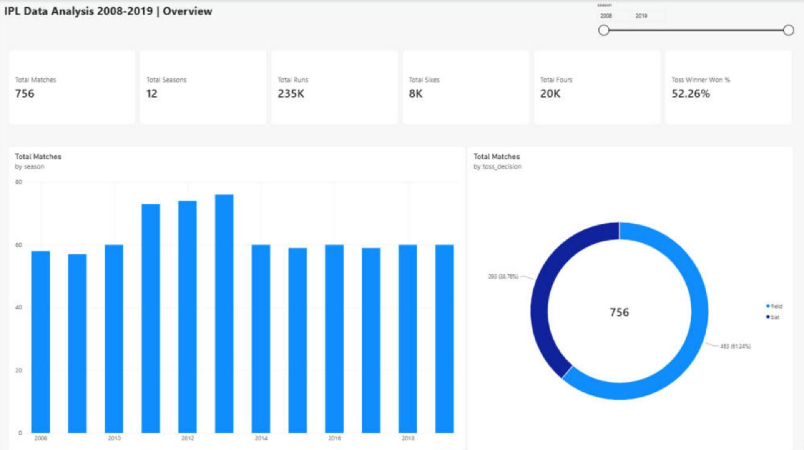

---

## 📁 Project Structure

```
IPL-DATA-ANALYSIS-TASK/
├── data/
│   ├── matches.csv                            # 756 matches (one row per match)
│   └── deliveries.csv                         # 179,078 deliveries (one row per ball)
├── notebook/
│   └── IPL_Data_Analysis_200_Questions.ipynb  # Python analysis: Pandas, Matplotlib, Seaborn
├── sql_analysis/
│   └── IPL_SQL_Data_Analysis.pdf              # 50 SQL queries with MySQL Workbench results
├── power_bi/
│   └── IPL_Dashboard.pbix                     # 5-page interactive Power BI dashboard
├── images/                                    # Screenshots used in this README
│   ├── notebook/
│   ├── sql/
│   └── power_bi/
├── requirements.txt
└── README.md
```

---

## 📊 Data

Source: [IPL dataset on Kaggle](https://www.kaggle.com/datasets/nowke9/ipldata)

| File | Rows | Description |
|------|------|-------------|
| `data/matches.csv` | 756 | Season, city, date, teams, toss winner & decision, result, winner, win margin (runs / wickets), player of the match, venue, umpires |
| `data/deliveries.csv` | 179,078 | Ball-by-ball data: match id, inning, batting & bowling team, over, ball, batsman, bowler, runs (batsman / extras / total), dismissal details |

**Data model:** `matches.id` **1 ── \*** `deliveries.match_id`

**Data preparation**
- Season stored as text (`IPL-2017`) is converted to a numeric `season` (`2017`)
- Dates (`dd-mm-yyyy`) are converted to proper date values in MySQL
- Missing values: 7 cities, 4 winners (no-result matches), 4 Player of the Match entries, and `umpire3` in most rows
- `deliveries.csv` has 23 fully duplicated rows, so the SQL table uses a surrogate key (`delivery_id`)

---

## 🐍 Python Analysis

Notebook: [`notebook/IPL_Data_Analysis_200_Questions.ipynb`](notebook/IPL_Data_Analysis_200_Questions.ipynb)

200 analysis questions, all executed, so every table and all 50 charts can be viewed directly on GitHub.

| Section | Questions | Topics |
|---------|-----------|--------|
| A | 1–20 | Loading, `head`/`tail`, `shape`, `info`, `describe`, `sample`, Series vs DataFrame |
| B | 21–45 | `loc`, `iloc`, boolean filtering |
| C | 46–70 | Indexing, sorting, new columns, missing values, duplicates, type conversion |
| D | 71–110 | `groupby` and aggregation |
| E | 111–130 | Merging the two tables (inner / left / right / outer joins) |
| F | 131–150 | Integrated analysis: toss impact, biggest wins, top players and venues |
| G | 151–180 | Matplotlib: bar, line, pie, histogram, scatter, subplots |
| H | 181–200 | Seaborn: countplot, barplot, lineplot, histplot, scatterplot, heatmap |

**Sample charts**

| Matches per season & wins by team | Season-wise scoring |
|:---:|:---:|
| 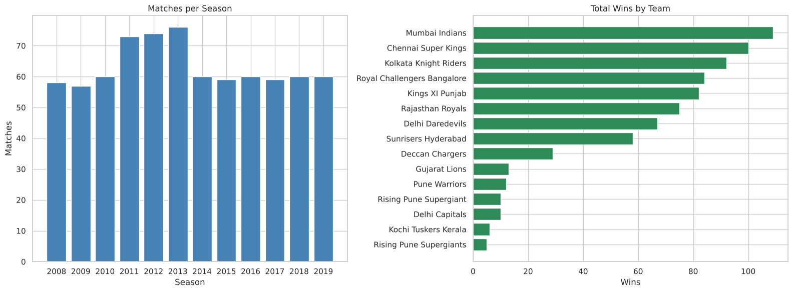 | 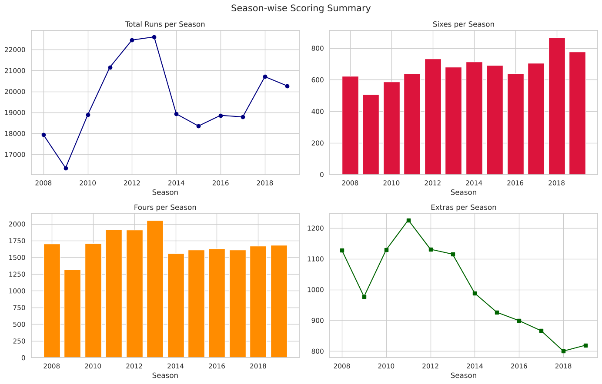 |
| **Top 20 batsmen: runs vs sixes** | **Correlation heatmap (matches)** |
| 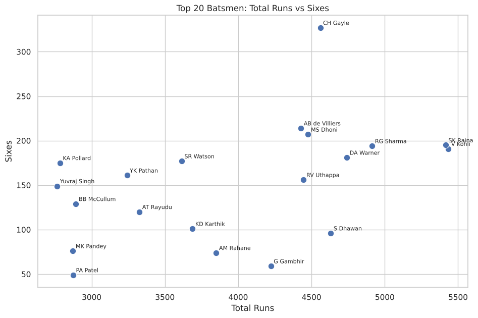 | 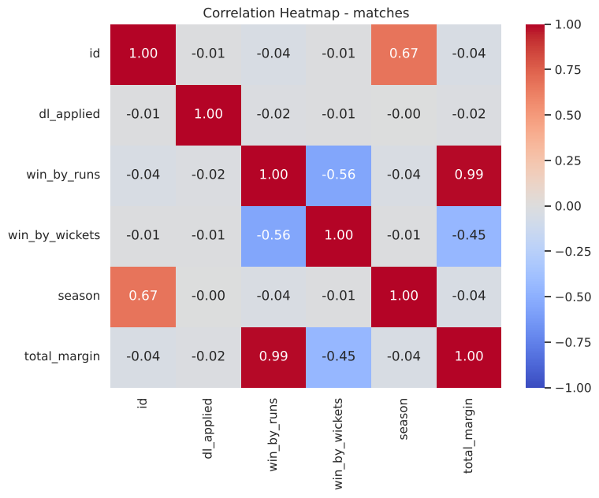 |

---

## 🗄️ SQL Analysis

Report: [`sql_analysis/IPL_SQL_Data_Analysis.pdf`](sql_analysis/IPL_SQL_Data_Analysis.pdf)

Both CSV files were loaded into a MySQL database `ipl_db` with `LOAD DATA LOCAL INFILE`:

- `matches`: primary key `id`
- `deliveries`: primary key `delivery_id`, foreign key `match_id` → `matches.id`

The report shows the database setup (table creation, CSV import, key check) followed by 50 queries and their results in MySQL Workbench.

| Part | Queries | Topics |
|------|---------|--------|
| A | 1–16 | Basic queries, `DISTINCT`, `WHERE`, `ORDER BY`, `LIMIT` |
| B | 17–27 | `GROUP BY` with `COUNT`, `AVG`, `MAX` |
| C | 28–40 | Ball-by-ball aggregation on `deliveries` |
| D | 41–50 | `JOIN` between `matches` and `deliveries` |

**Primary and foreign keys**

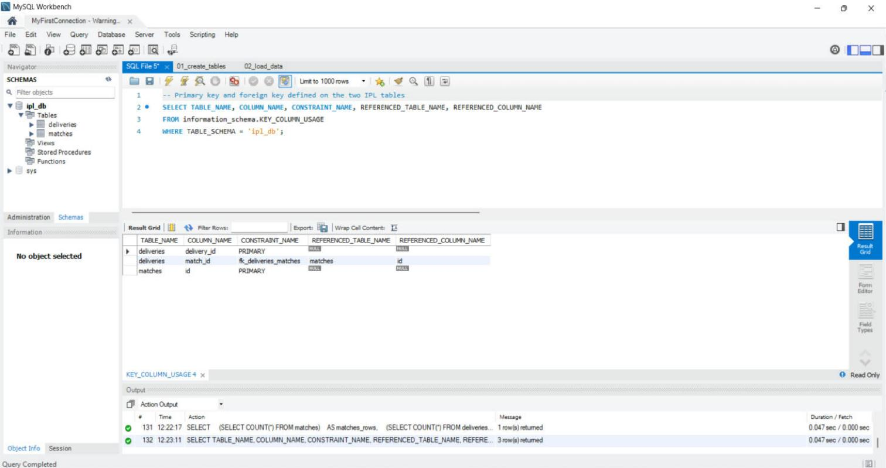

| Joining matches and deliveries | Top 10 run scorers in 2017 |
|:---:|:---:|
| 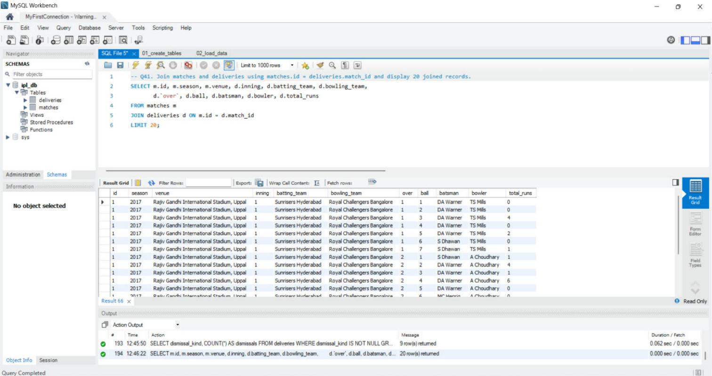 | 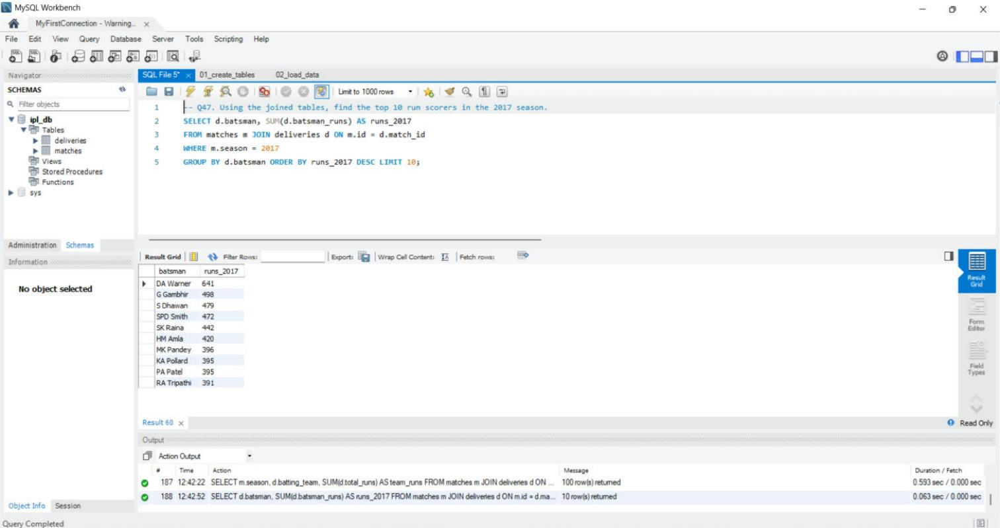 |

---

## 📈 Power BI Dashboard

File: [`power_bi/IPL_Dashboard.pbix`](power_bi/IPL_Dashboard.pbix) (open with Power BI Desktop)

Both tables are imported from the MySQL database (`localhost:3306` / `ipl_db`) with the relationship `matches[id]` 1 ── \* `deliveries[match_id]`. Every page has a **season slicer** that filters all of its visuals, and the ranking charts use Top 10 filters.

| Page | Visuals |
|------|---------|
| **Overview** | KPI cards (matches, seasons, runs, sixes, fours, toss-winner win %), matches per season, toss decision split |
| **Team Performance** | Wins by team, toss wins by team, match result split |
| **Batting Analysis** | Top 10 run scorers, top 10 six hitters, runs per season, sixes vs fours per season |
| **Bowling Analysis** | Top 10 wicket takers (run outs excluded), dismissal types, extras per season, runs conceded by bowling team |
| **Venues & Players** | Top 10 venues, top 10 Player of the Match winners, top 10 host cities, season summary table |

DAX measures: `Total Matches`, `Total Seasons`, `Matches Won`, `Toss Wins`, `POM Awards`, `Total Runs`, `Batsman Runs`, `Total Sixes`, `Total Fours`, `Extra Runs`, `Bowler Wickets`, `Dismissals`, `Deliveries Bowled`, `Toss Winner Won %`.

| Team Performance | Batting Analysis |
|:---:|:---:|
| 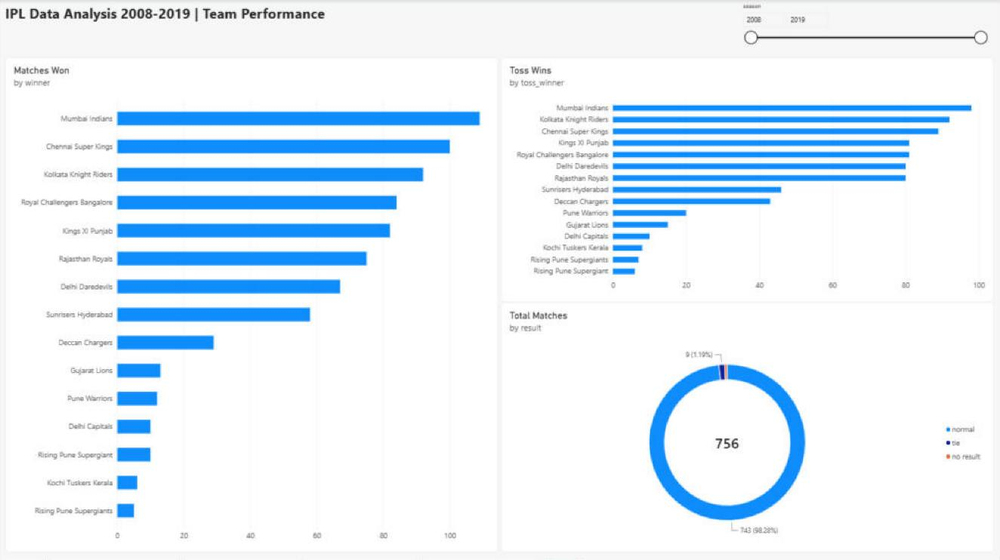 | 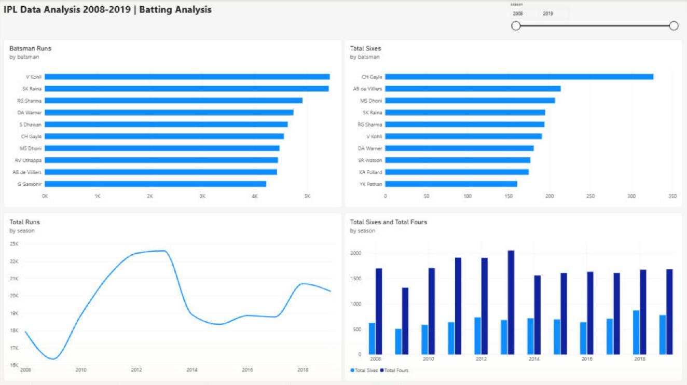 |
| **Bowling Analysis** | **Venues & Players** |
| 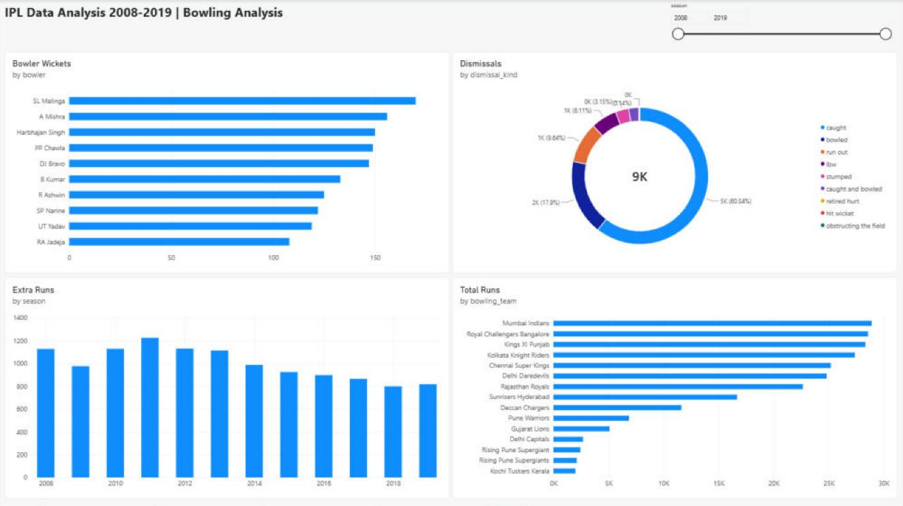 | 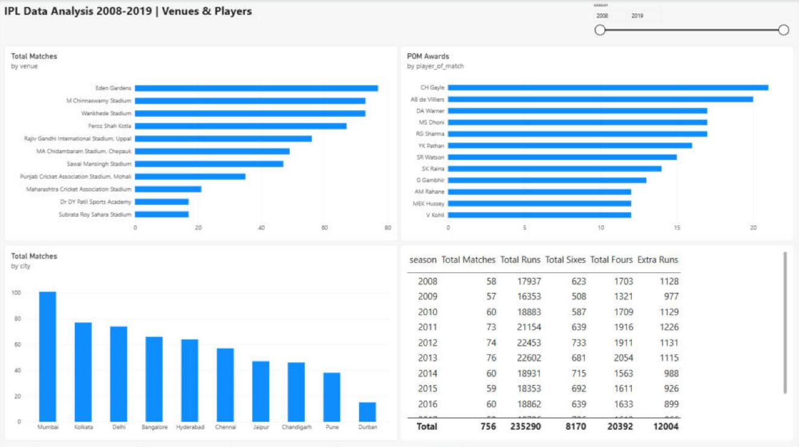 |

> Refreshing the dashboard needs the `ipl_db` MySQL database running locally (Home → Refresh).

---

## 🔍 Key Findings

- **Mumbai Indians** have the most wins (109), followed by Chennai Super Kings (100).
- **V Kohli** is the top run scorer (5,434 runs); **CH Gayle** hit the most sixes (327) and has the most Player of the Match awards (21).
- **SL Malinga** took the most wickets (170, excluding run outs).
- Teams chose to **field** after winning the toss in 463 of 756 matches; the toss winner went on to win **52.3%** of decided matches, so the toss gives only a small edge.
- **2013** had the most matches (76); total runs per season peaked in 2012–2013 (about 22,500).
- **Eden Gardens** hosted the most matches (77) and has the highest total runs of any venue.

---

## 🚀 Getting Started

```bash
git clone https://github.com/ManilBista/IPL-DATA-ANALYSIS-TASK.git
cd IPL-DATA-ANALYSIS-TASK
pip install -r requirements.txt
jupyter notebook notebook/IPL_Data_Analysis_200_Questions.ipynb
```

The notebook reads the data with relative paths (`../data/...`), so open it from the `notebook/` folder.

---

## 🛠️ Tech Stack

- **Python 3**: Pandas, NumPy, Matplotlib, Seaborn, Jupyter Notebook
- **MySQL** with **MySQL Workbench**
- **Power BI Desktop**: DAX measures and interactive dashboard
